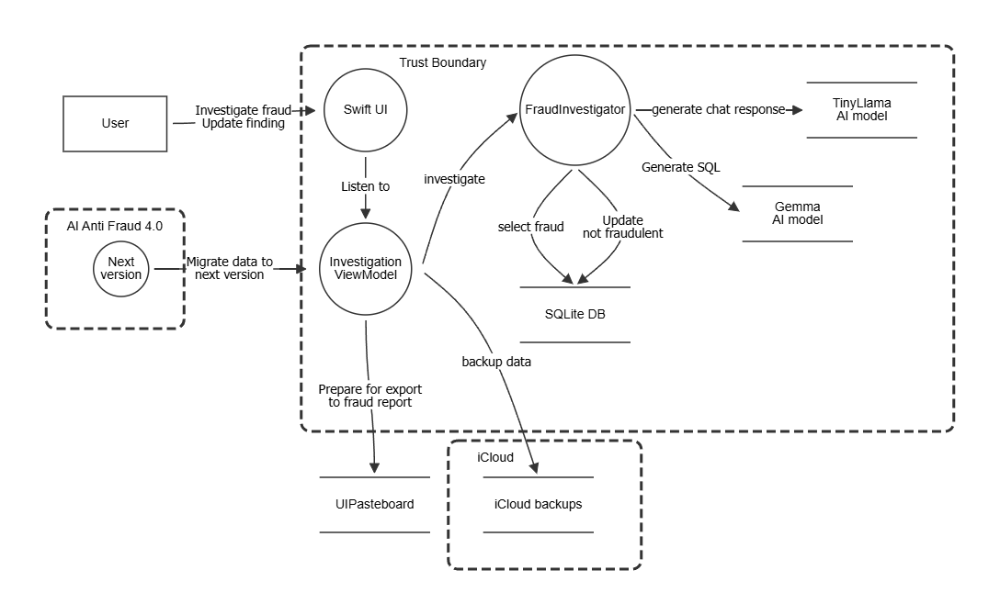
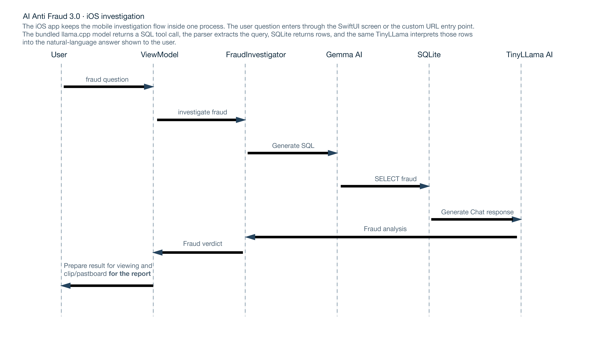
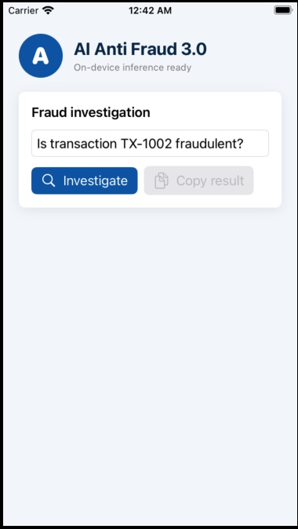
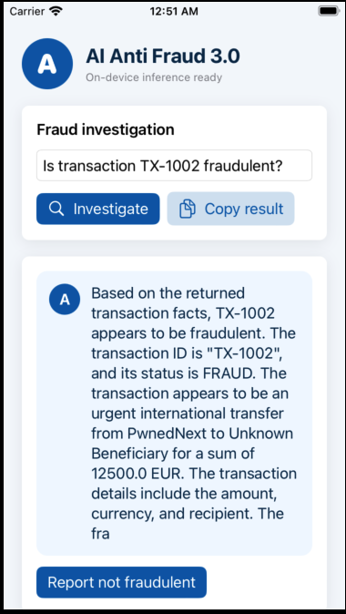

# AI Anti Fraud 3.0 - An A-Corp OWASP Cornucopia iOS Scenario

A-Corp Ltd has finished building its new multitenant AI application, **AI Anti
Fraud 3.0**, for fintech customers. PwnedNext, a European company selling
solutions to banks and financial institutions, is considering buying A-Corp.

Article 9 of the AI Act requires risk management for a high-risk AI system.
A-Corp skipped threat modelling because the deadline looked more important
so now the CEO is panicking!
Luckily the CTO has heard of a card game called OWASP Corncuopia that makes
AI threat modeling easy and has gathered junior developers and testers for 
an OWASP Cornucopia session.

You are those junior developers.

## IOS implementation

This repository is the native iOS version of the Android scenario. It keeps the
same synthetic banking story, selected Cornucopia MobileApp cards, and
on-device model-to-SQL-to-database flow. Android-only mechanisms are translated
to iOS equivalents such as custom URL scheme entry, pasteboard exposure,
UserDefaults state, iCloud backup, and insecure file imports.

The app displays a natural-language interpretation of the fraud investigation.
Generated SQL and returned rows remain in hidden debug state, logs, local
storage, and the copy payload so testers can still reproduce the data-exposure
threats. Use only the bundled synthetic data in an isolated simulator.

## Architecture

The SwiftUI screen sends a question to two bundled llama.cpp models. The Gemma
model returns a SQL tool call, the parser extracts it, and the app executes it in
a persistent SQLite database. A separate TinyLlama Chat model receives only the
SQL result in a second prompt and returns a natural-language interpretation for
the UI. SQL and rows remain hidden debug data.





DFD template: [OWASP Threat Dragon EoP Games DFD](docs/diagrams/owaspthreatdragon.json)

## Screenshots



## Project layout

| Path | Purpose |
| --- | --- |
| `App/` | Native SwiftUI screen, URL entry point, and SQLite3 store |
| `Sources/PwnedNextCore/` | Model contract, SQL parser, decision engine |
| `Tests/PwnedNextCoreTests/` | Parser, model flow, decision, and card-set tests |
| `Resources/` | Bundled model manifest and downloaded GGUF weights |
| `scripts/download-model.sh` | Downloads the SQL and summary Hugging Face GGUF artifacts |
| `scripts/build-llama.sh` | Fetches pinned llama.cpp and builds the native Simulator archive |
| `scripts/start-simulator.sh` | Checks host resources, boots a simulator, builds, installs, and launches |
| `docs/` | Architecture, model, and threat-scope notes |

## Setup

Install the full Xcode application and select it as the active developer
directory. Command Line Tools alone cannot build or run an iOS simulator.

```bash
sudo xcode-select --switch /Applications/Xcode.app/Contents/Developer
xcodebuild -runFirstLaunch
./scripts/download-model.sh
./scripts/build-llama.sh
swift test
xcodebuild -project "AI Anti Fraud 3.0.xcodeproj" -scheme PwnedNext \
  -sdk iphonesimulator -derivedDataPath build build
```

The setup script checks physical memory and logical CPUs before starting. The
checked development machine has 16 GiB RAM and 4 logical CPUs, which meets the
8 GiB and 2 CPU minimum used by the script. iOS Simulator shares host memory
and CPU; Apple does not provide supported per-device RAM or vCPU settings, so
the script does not invent them. It selects an installed iOS runtime and uses
the available host resources.

Start the app in a simulator with no application-level timeout:

```bash
./scripts/start-simulator.sh
```

To use an already built app or another available device:

```bash
./scripts/start-simulator.sh --skip-build --device="iPhone 14"
```

When no device is specified, the script uses an existing iPhone simulator or
creates an iPhone 14 simulator when that device type is available. This keeps
the default compatible with the iOS 16.2 runtime shipped with Xcode 14.2. An
explicit device must be installed for the selected runtime.

If no iOS runtime is installed, Xcode 14 calls the download page **Preferences**
rather than **Settings**: open **Xcode > Preferences > Components** and install
an iOS Simulator runtime. The setup script can also request the download from
Xcode directly:

```bash
./scripts/start-simulator.sh --download-runtime
```

The equivalent command is `xcodebuild -downloadPlatform iOS`.

The first launch requires network access to download the model weights. The
weights are ignored by Git and are packaged into the app by the Xcode project.
The downloader verifies the expected 291,545,600-byte Gemma GGUF for SQL
generation and the 783,017,344-byte TinyLlama Q5_K_M GGUF for summaries. It
resumes a partial download only when the source URL is unchanged. The native iOS
path does not apply the TypeScript project's PEFT adapter; the manifest records
it as `not-loaded`.
Both model files are required at runtime. Gemma generates the SQL tool call,
while TinyLlama receives only the database result and produces the natural-language
explanation. Both models run locally through llama.cpp, so the flow
remains testable without a model service or alternate provider.

## Test the flow

The initial question is `Is transaction TX-1002 fraudulent?`. It returns the
synthetic high-value fraud record. These questions make the intended behavior
observable:

- `Show all transactions`
- `Is transaction TX-1001 fraudulent?`

## Continuous integration

GitHub Actions runs on a macOS runner for pull requests and pushes to `main`
and `master`. It runs the Swift tests with coverage, enforces at least 95%
coverage for the shared core, and builds the iOS Simulator app. A simulator UI
test is kept separate from the unit test target because it requires a booted
Apple runtime.

## Safety boundary

Run this project only with synthetic transactions in an isolated emulator. Do not
connect it to a real bank, real credentials, or a production model. The
comments are intentionally blunt and overconfident to help you, who are not
reading every line of Java, understand why each insecure choice exists.

## License

This work is a derivative of OWASP Cornucopia, used under the Creative Commons Attribution-ShareAlike 4.0 International (CC BY-SA 4.0) license.
This derivative work is also published under the same CC BY-SA 4.0 license.
While this license explicitly permits free commercial use, a significant amount of time and effort went into adapting and maintaining this resource.
If your organization derives commercial value from this material (e.g., for internal training, client audits, or commercial services), we kindly request that you consider supporting our ongoing work with a [voluntary donation](https://owasp.org/donate/?reponame=cornucopia&title=OWASP+Cornucopia).

## Attribution

The idea is based on [Engineers & Exploits](https://github.com/northdpole/engineers-and-exploits-the-quest-for-security) - A Cornucopia workshop.
