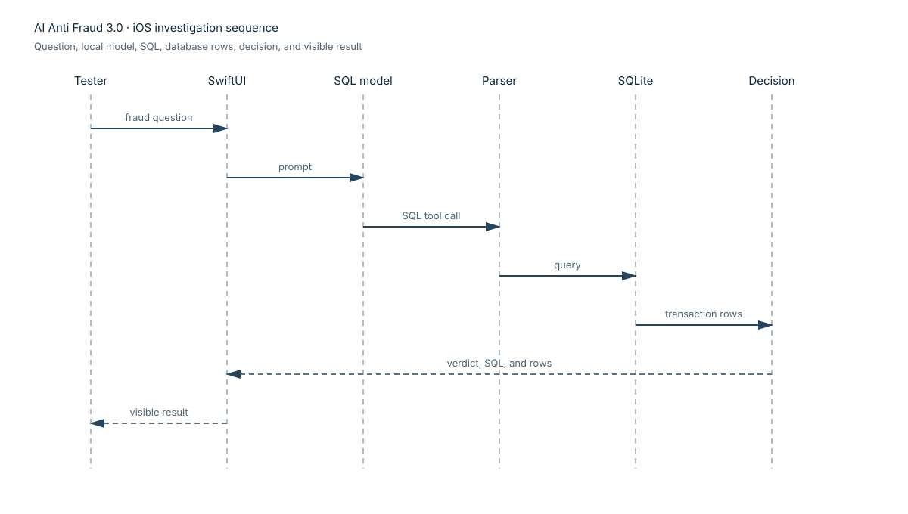

# Architecture and trust boundaries

The iOS app keeps the mobile investigation flow inside one process. The user
question enters through the SwiftUI screen or the custom URL entry point. The
bundled llama.cpp model returns a SQL tool call, the parser extracts the query,
SQLite returns rows, and the same model interprets those rows into the
natural-language answer shown to the user. SQL and rows remain hidden debug
data.

The diagrams deliberately show only normal data movement. They contain no
vulnerability labels so they can be reused as a neutral architecture exercise.